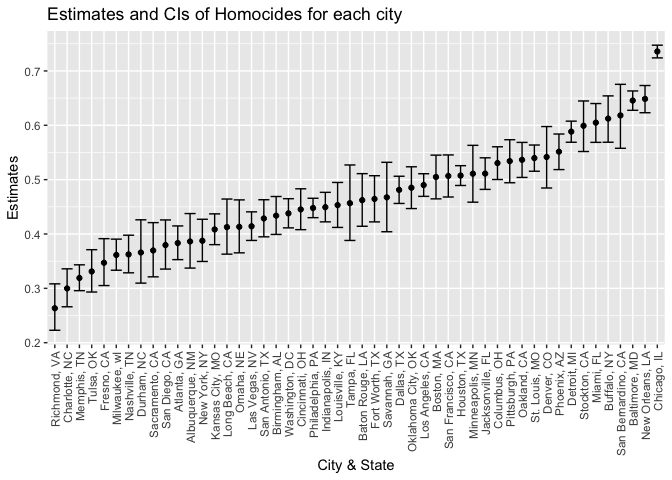

Homework 5
================
Ziyu Chen
11/19/2021

\#R setup

``` r
library(readxl)
library(tidyverse)
```

# Problem 1

-   Read in the data

``` r
murder_raw = 
  read_csv(url("https://github.com/washingtonpost/data-homicides/raw/master/homicide-data.csv")) 
```

Murder\_df has 52179 observations and 12 variables, including city,
city\_state, disposition, lat, lon, reported\_date, state, uid,
victim\_age, victim\_first, victim\_last, victim\_race, victim\_sex.
This dataset contains information about homicide cases in the United
States.

-   Create the city\_state variable, find the murders count within the
    city\_

``` r
murder_new = murder_raw %>%
   mutate(city_state = str_c(city, state, sep = ", ")) %>%
  group_by(city_state) %>%
   subset(city_state != "Tulsa, AL")


murder_total=
murder_new %>%
  group_by(city_state) %>%
  summarise(total = n())

murder_unsolved =
  murder_new %>%
  filter(disposition %in% c("Closed without arrest","Open/No arrest")) %>%
  group_by(city_state) %>%
  summarise(unsolved = n())

final = merge(murder_total, murder_unsolved, by = "city_state")
  
  knitr::kable(final [1:10, ]) #showing the only first ten rows to make sure that the data are correct
```

| city\_state     | total | unsolved |
|:----------------|------:|---------:|
| Albuquerque, NM |   378 |      146 |
| Atlanta, GA     |   973 |      373 |
| Baltimore, MD   |  2827 |     1825 |
| Baton Rouge, LA |   424 |      196 |
| Birmingham, AL  |   800 |      347 |
| Boston, MA      |   614 |      310 |
| Buffalo, NY     |   521 |      319 |
| Charlotte, NC   |   687 |      206 |
| Chicago, IL     |  5535 |     4073 |
| Cincinnati, OH  |   694 |      309 |

The final table will have information the total and unsolved cases for
cities in the US.

-   prop.test function on baltimore

``` r
prop.test(
    x=murder_unsolved %>% 
    filter(city_state == "Baltimore, MD") %>%
    pull(unsolved),
    n=murder_total %>%
    filter(city_state == "Baltimore, MD") %>%
    pull(total)) %>%
  broom::tidy()                
```

    ## # A tibble: 1 × 8
    ##   estimate statistic  p.value parameter conf.low conf.high method    alternative
    ##      <dbl>     <dbl>    <dbl>     <int>    <dbl>     <dbl> <chr>     <chr>      
    ## 1    0.646      239. 6.46e-54         1    0.628     0.663 1-sample… two.sided

-   Proportion of unsolved homicides and the confidence interval for
    each city

``` r
  final_new = final %>%
  mutate(
    prop = map2(.x = unsolved,               
                .y = total, 
                ~prop.test(x = .x, n = .y)),
    tidy = map(.x = prop,           
               ~broom::tidy(.x))) %>%             
  unnest(tidy) %>%                                       
  select(city_state, estimate, conf.low, conf.high)
  
final_new
```

    ## # A tibble: 50 × 4
    ##    city_state      estimate conf.low conf.high
    ##    <chr>              <dbl>    <dbl>     <dbl>
    ##  1 Albuquerque, NM    0.386    0.337     0.438
    ##  2 Atlanta, GA        0.383    0.353     0.415
    ##  3 Baltimore, MD      0.646    0.628     0.663
    ##  4 Baton Rouge, LA    0.462    0.414     0.511
    ##  5 Birmingham, AL     0.434    0.399     0.469
    ##  6 Boston, MA         0.505    0.465     0.545
    ##  7 Buffalo, NY        0.612    0.569     0.654
    ##  8 Charlotte, NC      0.300    0.266     0.336
    ##  9 Chicago, IL        0.736    0.724     0.747
    ## 10 Cincinnati, OH     0.445    0.408     0.483
    ## # … with 40 more rows

Make the plot

``` r
city_plot = 
  final_new %>%
mutate(city_state = fct_reorder(city_state,estimate)) %>%                
  ggplot(aes(x = city_state, y = estimate)) +
  geom_point() + 
  geom_errorbar(aes(ymin = conf.low , ymax = conf.high)) +
  theme(axis.text.x = element_text(angle = 90, vjust = 0.6, hjust = 1)) +
  ggtitle("Estimates and CIs of Homocides for each city") +
  xlab("City & State") +
  ylab("Estimates") 
city_plot
```

<!-- -->

# Problem 2

-   Read in the data

``` r
p2_raw = 
  tibble(file = list.files("./data/"),
         path = str_c("./data/", file)) 
```

-   Iterate over file names and read in data for each subject using
    purrr::map

``` r
P2_new =
  p2_raw %>%
  
  mutate(
    data = map(.x = path, ~read_csv(.x)),
    arm = str_remove(path,".csv"),
    arm = str_remove(arm, "./p2data/")) %>%
  separate(arm, c("arm","id"), sep = "_") %>%
  
  mutate(
    arm = ifelse(arm == "con","control","experiment"))%>%
  unnest(data) %>%
  select(-path, -file) %>%
  pivot_longer(
    week_1:week_8,
    values_to = "Observation",
    names_to = "Week") 
```
