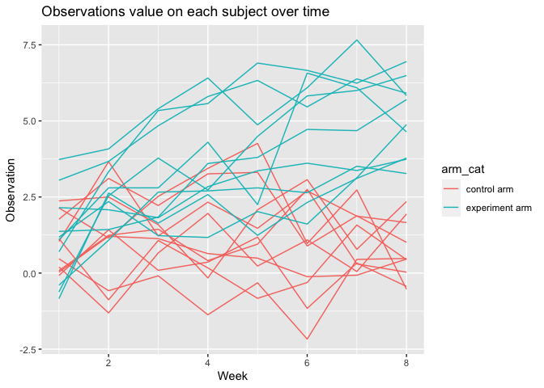

Homework 5
================
Ziyu Chen
11/19/2021

\#R setup

``` r
library(readxl)
library(tidyverse)
```

# Problem 1

-   Read in the data

``` r
murder_raw = 
  read_csv(url("https://github.com/washingtonpost/data-homicides/raw/master/homicide-data.csv")) 
```

Murder\_df has 52179 observations and 12 variables, including city,
city\_state, disposition, lat, lon, reported\_date, state, uid,
victim\_age, victim\_first, victim\_last, victim\_race, victim\_sex.
This dataset contains information about homicide cases in the United
States.

-   Create the city\_state variable, find the murders count within the
    city\_

``` r
murder_new = murder_raw %>%
   mutate(city_state = str_c(city, state, sep = ", ")) %>%
  group_by(city_state) %>%
   subset(city_state != "Tulsa, AL")


murder_total=
murder_new %>%
  group_by(city_state) %>%
  summarise(total = n())

murder_unsolved =
  murder_new %>%
  filter(disposition %in% c("Closed without arrest","Open/No arrest")) %>%
  group_by(city_state) %>%
  summarise(unsolved = n())

final = merge(murder_total, murder_unsolved, by = "city_state")
  
  knitr::kable(final)
```

| city\_state        | total | unsolved |
|:-------------------|------:|---------:|
| Albuquerque, NM    |   378 |      146 |
| Atlanta, GA        |   973 |      373 |
| Baltimore, MD      |  2827 |     1825 |
| Baton Rouge, LA    |   424 |      196 |
| Birmingham, AL     |   800 |      347 |
| Boston, MA         |   614 |      310 |
| Buffalo, NY        |   521 |      319 |
| Charlotte, NC      |   687 |      206 |
| Chicago, IL        |  5535 |     4073 |
| Cincinnati, OH     |   694 |      309 |
| Columbus, OH       |  1084 |      575 |
| Dallas, TX         |  1567 |      754 |
| Denver, CO         |   312 |      169 |
| Detroit, MI        |  2519 |     1482 |
| Durham, NC         |   276 |      101 |
| Fort Worth, TX     |   549 |      255 |
| Fresno, CA         |   487 |      169 |
| Houston, TX        |  2942 |     1493 |
| Indianapolis, IN   |  1322 |      594 |
| Jacksonville, FL   |  1168 |      597 |
| Kansas City, MO    |  1190 |      486 |
| Las Vegas, NV      |  1381 |      572 |
| Long Beach, CA     |   378 |      156 |
| Los Angeles, CA    |  2257 |     1106 |
| Louisville, KY     |   576 |      261 |
| Memphis, TN        |  1514 |      483 |
| Miami, FL          |   744 |      450 |
| Milwaukee, wI      |  1115 |      403 |
| Minneapolis, MN    |   366 |      187 |
| Nashville, TN      |   767 |      278 |
| New Orleans, LA    |  1434 |      930 |
| New York, NY       |   627 |      243 |
| Oakland, CA        |   947 |      508 |
| Oklahoma City, OK  |   672 |      326 |
| Omaha, NE          |   409 |      169 |
| Philadelphia, PA   |  3037 |     1360 |
| Phoenix, AZ        |   914 |      504 |
| Pittsburgh, PA     |   631 |      337 |
| Richmond, VA       |   429 |      113 |
| Sacramento, CA     |   376 |      139 |
| San Antonio, TX    |   833 |      357 |
| San Bernardino, CA |   275 |      170 |
| San Diego, CA      |   461 |      175 |
| San Francisco, CA  |   663 |      336 |
| Savannah, GA       |   246 |      115 |
| St. Louis, MO      |  1677 |      905 |
| Stockton, CA       |   444 |      266 |
| Tampa, FL          |   208 |       95 |
| Tulsa, OK          |   583 |      193 |
| Washington, DC     |  1345 |      589 |

-   The final table will have information the total and unsolved cases
    for cities in the US.

-   prop.test function on baltimore

``` r
prop.test(
    x=murder_unsolved %>% 
    filter(city_state == "Baltimore, MD") %>%
    pull(unsolved),
    n=murder_total %>%
    filter(city_state == "Baltimore, MD") %>%
    pull(total)) %>%
  broom::tidy()                
```

    ## # A tibble: 1 × 8
    ##   estimate statistic  p.value parameter conf.low conf.high method    alternative
    ##      <dbl>     <dbl>    <dbl>     <int>    <dbl>     <dbl> <chr>     <chr>      
    ## 1    0.646      239. 6.46e-54         1    0.628     0.663 1-sample… two.sided

-   Proportion of unsolved homicides and the confidence interval for
    each city

``` r
  final_new = final %>%
  mutate(
    prop = map2(.x = unsolved,               
                .y = total, 
                ~prop.test(x = .x, n = .y)),
    tidy = map(.x = prop,           
               ~broom::tidy(.x))) %>%             
  unnest(tidy) %>%                                       
  select(city_state, estimate, conf.low, conf.high)
  
final_new
```

    ## # A tibble: 50 × 4
    ##    city_state      estimate conf.low conf.high
    ##    <chr>              <dbl>    <dbl>     <dbl>
    ##  1 Albuquerque, NM    0.386    0.337     0.438
    ##  2 Atlanta, GA        0.383    0.353     0.415
    ##  3 Baltimore, MD      0.646    0.628     0.663
    ##  4 Baton Rouge, LA    0.462    0.414     0.511
    ##  5 Birmingham, AL     0.434    0.399     0.469
    ##  6 Boston, MA         0.505    0.465     0.545
    ##  7 Buffalo, NY        0.612    0.569     0.654
    ##  8 Charlotte, NC      0.300    0.266     0.336
    ##  9 Chicago, IL        0.736    0.724     0.747
    ## 10 Cincinnati, OH     0.445    0.408     0.483
    ## # … with 40 more rows

Make the plot

``` r
city_plot = 
  final_new %>%
mutate(city_state = fct_reorder(city_state,estimate)) %>%                
  ggplot(aes(x = city_state, y = estimate)) +
  geom_point() + 
  geom_errorbar(aes(ymin = conf.low , ymax = conf.high)) +
  theme(axis.text.x = element_text(angle = 90, vjust = 0.6, hjust = 1)) +
  ggtitle("Estimates and CIs of Homocides for each city") +
  xlab("City & State") +
  ylab("Estimates") 
city_plot
```

<!-- -->

# Problem 2

-   Read in the data

``` r
p2_raw = 
  tibble(file = list.files("./data/"),   # read in the data
         path = str_c("./data/", file)) 
```

-   Iterate over file names and read in data for each subject using
    purrr::map

``` r
read_data = function (name) {read_csv(str_c("./data/", name))
}
  
p2_raw %>% 
  mutate(data = map(file, read_data)) %>%
  unnest(data)
```

    ## # A tibble: 20 × 10
    ##    file       path       week_1 week_2 week_3 week_4 week_5 week_6 week_7 week_8
    ##    <chr>      <chr>       <dbl>  <dbl>  <dbl>  <dbl>  <dbl>  <dbl>  <dbl>  <dbl>
    ##  1 con_01.csv ./data/co…   0.2   -1.31   0.66   1.96   0.23   1.09   0.05   1.94
    ##  2 con_02.csv ./data/co…   1.13  -0.88   1.07   0.17  -0.83  -0.31   1.58   0.44
    ##  3 con_03.csv ./data/co…   1.77   3.11   2.22   3.26   3.31   0.89   1.88   1.01
    ##  4 con_04.csv ./data/co…   1.04   3.66   1.22   2.33   1.47   2.7    1.87   1.66
    ##  5 con_05.csv ./data/co…   0.47  -0.58  -0.09  -1.37  -0.32  -2.17   0.45   0.48
    ##  6 con_06.csv ./data/co…   2.37   2.5    1.59  -0.16   2.08   3.07   0.78   2.35
    ##  7 con_07.csv ./data/co…   0.03   1.21   1.13   0.64   0.49  -0.12  -0.07   0.46
    ##  8 con_08.csv ./data/co…  -0.08   1.42   0.09   0.36   1.18  -1.16   0.33  -0.44
    ##  9 con_09.csv ./data/co…   0.08   1.24   1.44   0.41   0.95   2.75   0.3    0.03
    ## 10 con_10.csv ./data/co…   2.14   1.15   2.52   3.44   4.26   0.97   2.73  -0.53
    ## 11 exp_01.csv ./data/ex…   3.05   3.67   4.84   5.8    6.33   5.46   6.38   5.91
    ## 12 exp_02.csv ./data/ex…  -0.84   2.63   1.64   2.58   1.24   2.32   3.11   3.78
    ## 13 exp_03.csv ./data/ex…   2.15   2.08   1.82   2.84   3.36   3.61   3.37   3.74
    ## 14 exp_04.csv ./data/ex…  -0.62   2.54   3.78   2.73   4.49   5.82   6      6.49
    ## 15 exp_05.csv ./data/ex…   0.7    3.33   5.34   5.57   6.9    6.66   6.24   6.95
    ## 16 exp_06.csv ./data/ex…   3.73   4.08   5.4    6.41   4.87   6.09   7.66   5.83
    ## 17 exp_07.csv ./data/ex…   1.18   2.35   1.23   1.17   2.02   1.61   3.13   4.88
    ## 18 exp_08.csv ./data/ex…   1.37   1.43   1.84   3.6    3.8    4.72   4.68   5.7 
    ## 19 exp_09.csv ./data/ex…  -0.4    1.08   2.66   2.7    2.8    2.64   3.51   3.27
    ## 20 exp_10.csv ./data/ex…   1.09   2.8    2.8    4.3    2.25   6.57   6.09   4.64

``` r
P2_new =
  p2_raw %>%
  
  mutate(
    data = map(.x = path, ~read_csv(.x)),
    arm = str_remove(path,".csv"), arm = str_remove(arm, "./data/")) %>%  #continue to remove the extra string in the dataset
  separate(arm, into = c("arm","id"), sep = "_") %>%
  mutate(
    arm = if_else(arm == "con","control arm","experiment arm"))%>%       #creating the categories for treatment arm
  unnest(data) %>%
  pivot_longer(
    week_1:week_8,
    values_to = "Observation",
    names_to = "Week",
    names_prefix = "week_") %>%
    mutate (
      Week= as.numeric(Week),
      arm_cat = arm) %>%
     unite("ID",c(arm,id)) 
```

Making spagetti plot

``` r
P2_plot = P2_new %>%
  select(-path, -file) %>%
  ggplot() +
  geom_line(aes(x = Week, y = Observation, group = ID, color = arm_cat)) +
  ggtitle("Observations On Each Subject Over Time") +
  labs(title = "Observations value on each subject over time")
    
  
P2_plot
```

<!-- -->

-   As we can see, the the value of observation count in control group
    are usually lower than the experiement arm and the counts gradully
    increase over time.

# Problem 3

-   Insert the sample chunk and take a look at the dataset

``` r
set.seed(10)

iris_with_missing = iris %>% 
  map_df(~replace(.x, sample(1:150, 20), NA)) %>%
  mutate(Species = as.character(Species)) 

iris_with_missing
```

    ## # A tibble: 150 × 5
    ##    Sepal.Length Sepal.Width Petal.Length Petal.Width Species
    ##           <dbl>       <dbl>        <dbl>       <dbl> <chr>  
    ##  1          5.1         3.5          1.4         0.2 setosa 
    ##  2          4.9         3            1.4         0.2 setosa 
    ##  3          4.7         3.2          1.3         0.2 setosa 
    ##  4          4.6         3.1          1.5        NA   setosa 
    ##  5          5           3.6          1.4         0.2 setosa 
    ##  6          5.4         3.9          1.7         0.4 setosa 
    ##  7         NA           3.4          1.4         0.3 setosa 
    ##  8          5           3.4          1.5         0.2 setosa 
    ##  9          4.4         2.9          1.4         0.2 setosa 
    ## 10          4.9         3.1         NA           0.1 setosa 
    ## # … with 140 more rows

-   write a function that provides with missing data

``` r
iris_new = 
  iris_with_missing %>%
  janitor::clean_names() %>%
  mutate(species = if_else(is.na(species), "virginica", species))

mean_sepal =
  mean(pull(iris_new, sepal_length),na.rm = TRUE)


filled = function(x) {
  
  if (is.na(x)) {
    if (is.numeric(x)) {x = mean_sepal}
    if (is.character(x)) {x = "virginica"}
  }
  return(x)
}
```

-   Applying function to the final data set

``` r
iris_final =
  iris_new %>%
  mutate(sepal_length = map(pull(iris_new,sepal_length),filled),
         species = map(pull(iris_new,species),filled))

iris_final
```

    ## # A tibble: 150 × 5
    ##    sepal_length sepal_width petal_length petal_width species  
    ##    <list>             <dbl>        <dbl>       <dbl> <list>   
    ##  1 <dbl [1]>            3.5          1.4         0.2 <chr [1]>
    ##  2 <dbl [1]>            3            1.4         0.2 <chr [1]>
    ##  3 <dbl [1]>            3.2          1.3         0.2 <chr [1]>
    ##  4 <dbl [1]>            3.1          1.5        NA   <chr [1]>
    ##  5 <dbl [1]>            3.6          1.4         0.2 <chr [1]>
    ##  6 <dbl [1]>            3.9          1.7         0.4 <chr [1]>
    ##  7 <dbl [1]>            3.4          1.4         0.3 <chr [1]>
    ##  8 <dbl [1]>            3.4          1.5         0.2 <chr [1]>
    ##  9 <dbl [1]>            2.9          1.4         0.2 <chr [1]>
    ## 10 <dbl [1]>            3.1         NA           0.1 <chr [1]>
    ## # … with 140 more rows
